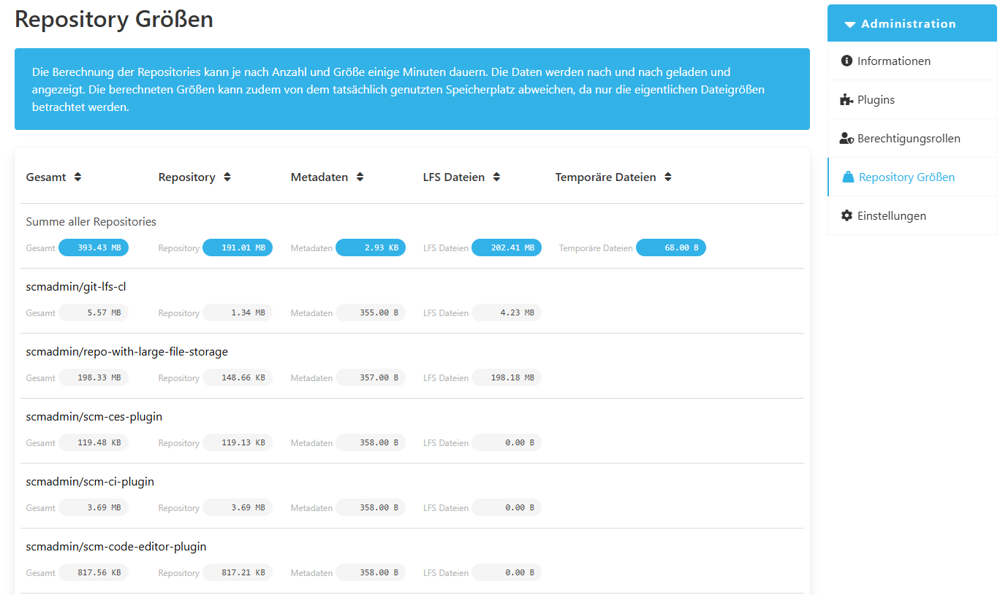

## Speichergrößen für Repositorys

In der Übersicht der Repository-Größen werden die Speichergrößen der Repositorys angezeigt. 
Diese Größen entsprechen den Dateigrößen und nicht dem tatsächlich belegten Festplattenplatz. 
Auch die Gesamtsumme der Größe eines Repositories wird aufgeführt.

Die Größe eines Repositories setzt sich aus dem Repository selbst, Metadaten, LFS Dateien und temporären Dateien zusammen:

* Repository: Dies repräsentiert die Gesamtgröße des data-Verzeichnisses, das alle im Repository gespeicherten Daten enthält.  
* Metadaten: Gibt die Größe des store-Verzeichnisses an, das einen speziellen Bereich darstellt, in dem beispielsweise Plugin-Konfigurationsdateien abgelegt werden.  
* LFS Daten: Dies bezieht sich auf die Größe des Git Large File Storage (LFS)-Verzeichnisses innerhalb des Repositories, das dazu dient, große Dateien getrennt vom Hauptverzeichnis zu speichern.  
* Temporäre Größe: Dies ist die kombinierte Größe der Export- und Arbeitsverzeichnisse des Repositorys, die für die temporäre Speicherung während verschiedener Operationen verwendet werden.

Am oberen Rand der Übersicht gibt es eine Möglichkeit, die Repositories nach ihrer Größe zu sortieren.

Die Übersicht besteht zunächst aus den summierten Größen aller Repositories. 
Anschließend werden die einzelnen Repositories aufgelistet.

