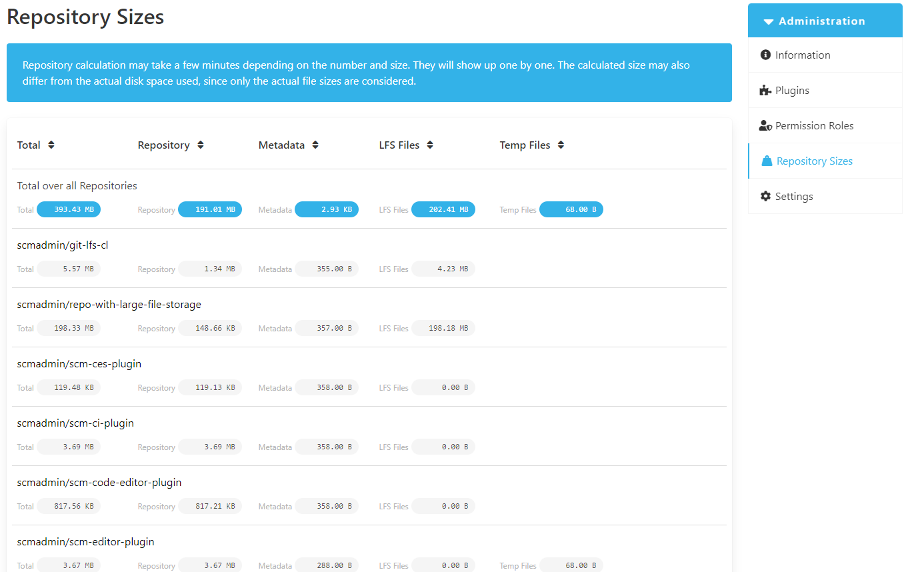

## Storage sizes for repositories

The storage sizes of the repositories are displayed in the repository sizes overview. 
These sizes correspond to the file sizes and not the disk space that is actually occupied. 
The total size of a repository is also listed.

The size of a repository consists of the repository itself, metadata, LFS files and temporary files:

* Repository: This represents the total size of the repository's data directory, which contains all the files and data stored in the repository.
* Metadata: Indicates the size of the repository's store directory, which represents a special area where, for example, plugin configuration files are stored.
* LFS Files: This refers to the size of the Git Large File Storage (LFS) directory within the repository, which is used to store large files separately from the main repository data.
* Temp Files: This is the combined size of the repository's export and work directories, which are used for temporary storage during various operations.

At the top of the overview there is an option to sort the repositories according to their size.

The overview initially consists of the totaled sizes of all repositories. 
The individual repositories are then listed.

